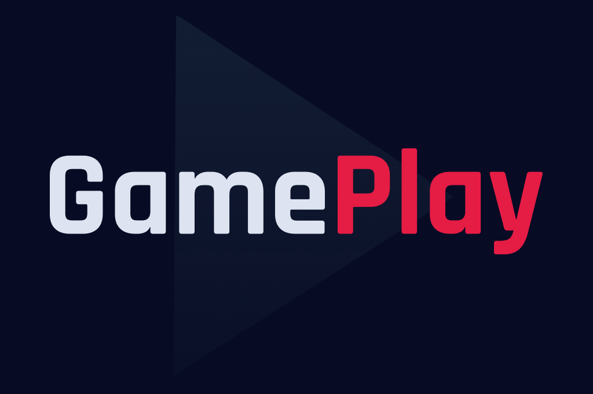

<h1 align="center">

</h1>

</br>

<p align="center">
<a href="#-project">Project</a>&nbsp;&nbsp;&nbsp;|&nbsp;&nbsp;&nbsp;
<a href="#hammer_and_wrench_features">Features</a>&nbsp;&nbsp;&nbsp;|&nbsp;&nbsp;&nbsp;
<a href="#books-technologies">Technologies</a>&nbsp;&nbsp;&nbsp;|&nbsp;&nbsp;&nbsp;
<a href="#gear-getting-started">Getting Started</a>&nbsp;&nbsp;&nbsp;|&nbsp;&nbsp;&nbsp;
  <a href="#memo-license">License</a>
</p>


<hr/>

## 💻 Project

<p>GamePlay is an app to help you connect and manager your gameplay with your friends. Create groups on Discord for yours favorite games with your friends and organize your gameplay time with this App.</p>

## :hammer_and_wrench: Features

- [x] Authentication with Discord OAuth2;
- [x] Get user profile data from Discord(username and avatar);
- [x] List all Discord guilds that user is inside;
- [x] Schedule a gameplay;
- [x] Filter your gameplay by category;
- [x] Show if a match was scheduled in your or others peoples gilds;
- [x] Share a Discord invitation if the match was scheduled in your guild;
- [x] Redirect user to your guild;
- [x] Logout

## :books: Technologies

This project was developed with the following technologies:

- [x] [Node.js](https://nodejs.org/en/)
- [x] [React native](https://reactnative.dev/)
- [x] [Expo](https://expo.io/)
- [x] [Typescript](https://www.typescriptlang.org/)
- [x] [Context API](https://reactjs.org/docs/context.html)
- [x] [Async Storage](https://docs.expo.io/versions/latest/sdk/async-storage/)
- [x] [Axios](https://github.com/axios/axios)
- [x] Vector Icons
- [x] React Native Svg e Svg Transform
- [x] Gradient colors
- [x] OAuth2 Discord
- [x] Expo Google Fonts
- [x] React Navigation Stack
- [x] React Native Gesture Handler
- [x] Expo Authentication
- [x] React Native Share
- [x] Deep Link

## :gear: Getting Started

<p>Clone project repository to your local directory:</p>

```bash
  $ git clone https://github.com/EdlanioJ/gameplay.git
```

<p>Install project dependencies:</p>

```bash
  $ npm install
  # or
  $ yarn install
```

Lembre-se de criar o seu App no servidor do Discord para obter as credencias de autenticação
Create an app in discord server to get your Authentication credencials and create a file `.env` with the following template [.env.example](.env.example).

```cl
REDIRECT_URI=
SCOPE=
RESPONSE_TYPE=
CLIENT_ID=
CDN_IMAGE=
```

<p>Run the project in development mode:</>

```bash
  $ expo start
```

Open with Expo Go app on [Android](https://play.google.com/store/apps/details?id=host.exp.exponent) or [Iphone](https://apps.apple.com/us/app/expo-go/id982107779), scanning the QR code.

## :memo License

This project is under the MIT license. See the archive [LICENSE](LICENSE) for more details.

Made with ♥ by Edlânio Júlio.
